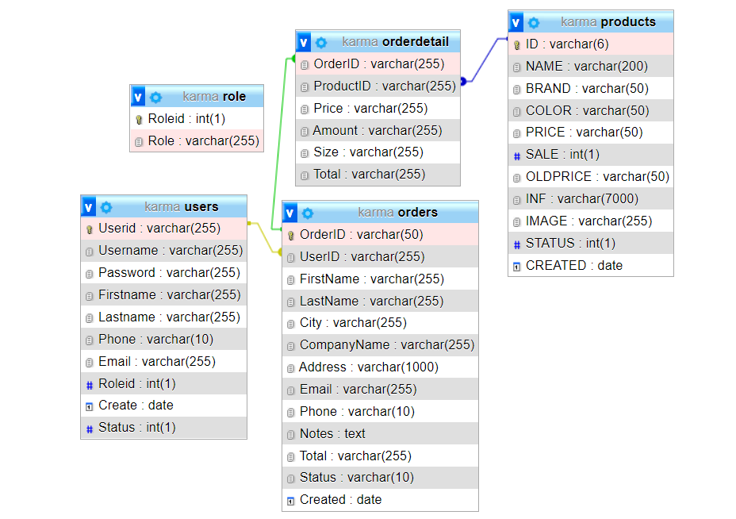
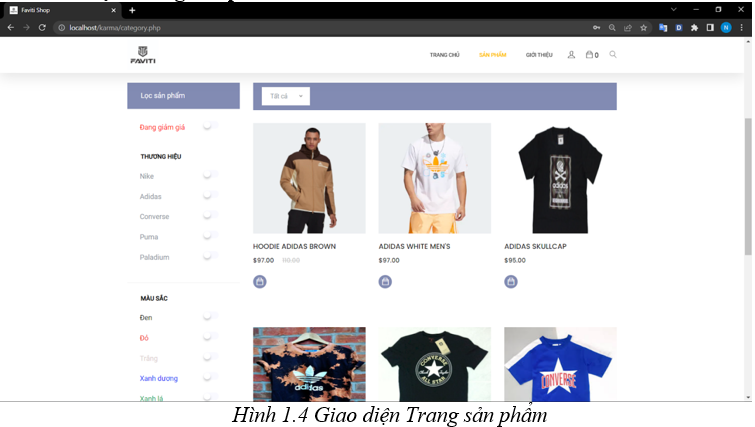
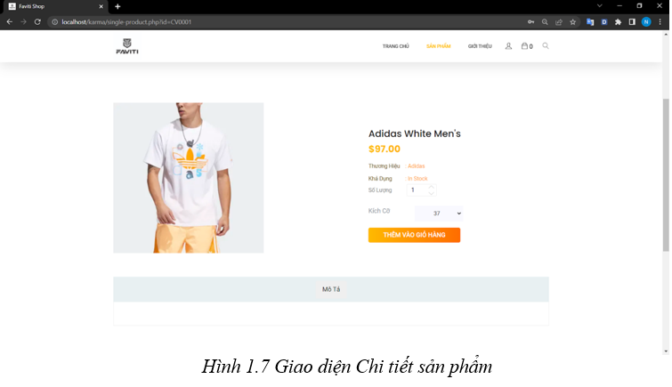
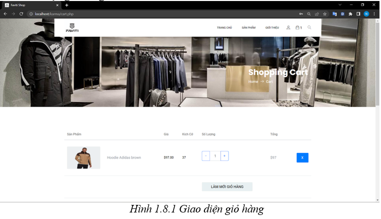
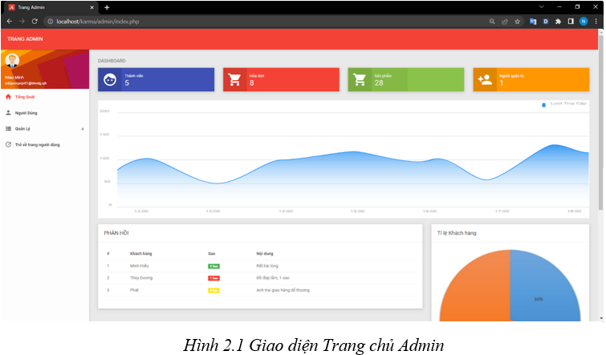
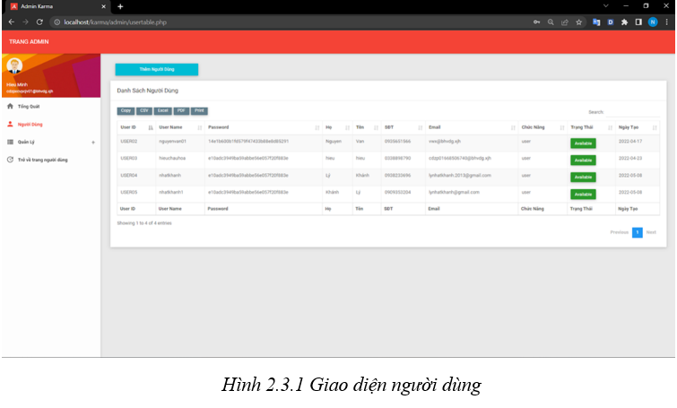

# An toàn và bảo mật hệ thống thông tin - Website bán quần áo


 

## Thành viên nhóm

| STT |    MSSV    | Họ và tên             |
| :-: | :--------: | --------------------- |
|  1  | 3119410439 | Minh Hiếu Calan Tog   |
|  2  | 3119410220 | Diệc Trác Lâm   |
|  3  | 3119410298 | Phạm Minh Phát   |
|  4  | 3119410185 | Lý Nhật Khánh   |


## Yêu Cầu:

- Xây dựng website có kết nối db, sử dụng ngôn ngữ php, có áp dụng kĩ thuật an toàn và bảo mật dữ liệu trong hệ thống thông tin <br/>

## Database




## Hướng dẫn cài đặt

Phần mềm chạy tốt với độ phân giải màn hình chuẩn của máy là > 1280x900 ( FullHD )

```
1. Tạo database "karma" và import file "db/karma.sql" vào phpadmin trên XAMPP .
```

```
2. Chạy web bằng đường dẫn: "http://localhost/ATBM_HTTT-Webite-_ban_quan_ao"
```

## Một số giao diện của website






